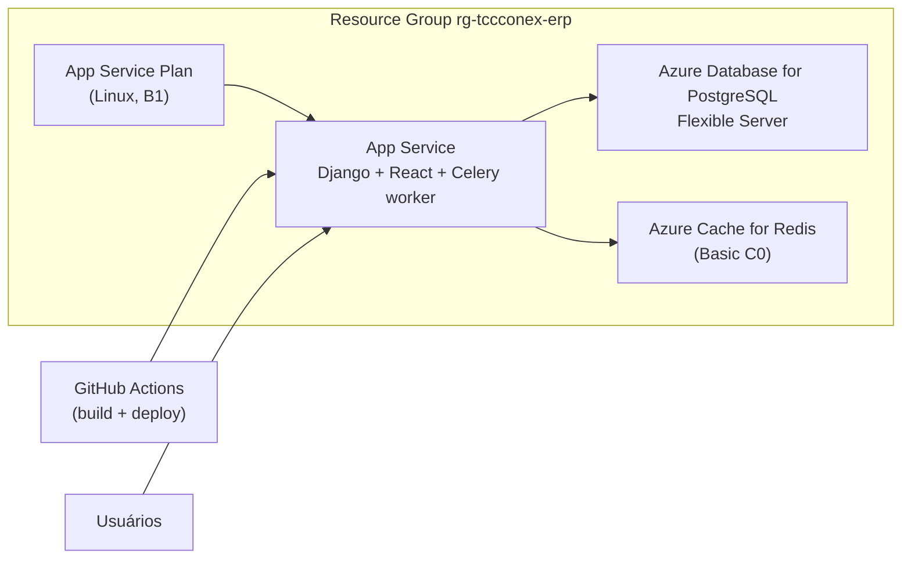

# Guia de Deploy — TccConex ERP na Azure

Este guia cobre o primeiro deploy do ERP (Django + React) na Azure: criação dos
recursos, variáveis de ambiente, CI/CD via GitHub Actions, migração dos dados
atuais para o Postgres e configuração do login com Google.

## Arquitetura

Um único **Azure App Service (Linux, Python)** roda o Django, que também serve
o build do React (WhiteNoise) — mesmo domínio, sem CORS entre front e back. O
worker do Celery roda como processo em background dentro do mesmo App Service
(`backend/startup.sh`), evitando um segundo recurso de compute.



## Pré-requisitos

- Conta Azure com uma assinatura ativa.
- Repositório GitHub já criado e com o código enviado:
  `https://github.com/Transcamila-Desenvolvimento/TccConex_IndicadoresTranscamila`
  (feito — branch `main`).
- Acesso ao [Google Cloud Console](https://console.cloud.google.com/apis/credentials)
  do projeto OAuth já usado pelo sistema (client ID/secret existentes).
- Azure CLI instalado localmente (`az --version`) — opcional, os mesmos passos
  podem ser feitos pelo [Portal Azure](https://portal.azure.com).

Escolha um nome único (prefixo do domínio `.azurewebsites.net`) para o App
Service, por exemplo `tccconex-erp`. Esse nome será usado em vários lugares
abaixo — substitua pelo nome real escolhido.

---

## 1. Criar os recursos na Azure

### Opção A — Azure CLI

```powershell
az login

az group create --name rg-tccconex-erp --location brazilsouth

# Banco de dados PostgreSQL
az postgres flexible-server create `
  --resource-group rg-tccconex-erp `
  --name tccconex-pg `
  --location brazilsouth `
  --admin-user prothonadmin `
  --admin-password "<SENHA-FORTE-AQUI>" `
  --sku-name Standard_B1ms `
  --tier Burstable `
  --storage-size 32 `
  --version 16 `
  --public-access 0.0.0.0-255.255.255.255   # restrinja depois (ver seção 6)

az postgres flexible-server db create `
  --resource-group rg-tccconex-erp `
  --server-name tccconex-pg `
  --database-name prothon_db

# Redis (broker do Celery)
az redis create `
  --resource-group rg-tccconex-erp `
  --name tccconex-redis `
  --location brazilsouth `
  --sku Basic `
  --vm-size c0

# App Service Plan + Web App (Python 3.12, Linux)
az appservice plan create `
  --resource-group rg-tccconex-erp `
  --name plan-tccconex `
  --is-linux `
  --sku B1

az webapp create `
  --resource-group rg-tccconex-erp `
  --plan plan-tccconex `
  --name tccconex-erp `
  --runtime "PYTHON:3.12"
```

### Opção B — Portal Azure (passo a passo)

1. **Resource Group**: `Criar um recurso` → `Grupo de recursos` → nome
   `rg-tccconex-erp`, região `Brazil South`.
2. **Azure Database for PostgreSQL Flexible Server**: `Criar um recurso` →
   pesquisar "Azure Database for PostgreSQL" → `Flexible server`.
   - Resource group: `rg-tccconex-erp`
   - Nome do servidor: `tccconex-pg`
   - Versão: `16`
   - Workload: `Development` (Burstable, `B1ms`)
   - Usuário admin/senha: anote — vai virar `DB_USER`/`DB_PASSWORD`
   - Rede: "Public access" habilitado (ajustamos o firewall depois)
   - Depois de criado, em **Databases**, crie o banco `prothon_db`.
3. **Azure Cache for Redis**: `Criar um recurso` → "Azure Cache for Redis".
   - Resource group: `rg-tccconex-erp`
   - Nome: `tccconex-redis`
   - Tier: `Basic C0`
4. **App Service Plan + Web App**: `Criar um recurso` → "Web App".
   - Resource group: `rg-tccconex-erp`
   - Nome: `tccconex-erp` (isso define a URL `https://tccconex-erp.azurewebsites.net`)
   - Publish: `Code`
   - Runtime stack: `Python 3.12`
   - Sistema operacional: `Linux`
   - Plano: novo, `B1` (Basic — necessário para "Always On")

---

## 2. Variáveis de ambiente do App Service

No Portal: **App Service → Configuration → Application settings → + New
application setting** (uma por linha). Via CLI, use
`az webapp config appsettings set --resource-group rg-tccconex-erp --name tccconex-erp --settings CHAVE=VALOR ...`.

| Variável | Valor | Observação |
|---|---|---|
| `DJANGO_SECRET_KEY` | gerar uma chave aleatória forte | ex.: `python -c "import secrets; print(secrets.token_urlsafe(50))"` |
| `DJANGO_DEBUG` | `False` | |
| `DJANGO_ALLOWED_HOSTS` | `tccconex-erp.azurewebsites.net` | |
| `CORS_ALLOWED_ORIGINS` | `https://tccconex-erp.azurewebsites.net` | mesmo domínio (front+back juntos) |
| `CSRF_TRUSTED_ORIGINS` | `https://tccconex-erp.azurewebsites.net` | necessário para o `/admin/` |
| `USE_POSTGRES` | `True` | |
| `DB_NAME` | `prothon_db` | |
| `DB_USER` | `prothonadmin` | usuário criado no passo 1 |
| `DB_PASSWORD` | `<SENHA-FORTE-AQUI>` | |
| `DB_HOST` | `tccconex-pg.postgres.database.azure.com` | |
| `DB_PORT` | `5432` | |
| `DB_SSLMODE` | `require` | Azure Postgres exige SSL |
| `USE_CELERY` | `True` | |
| `CELERY_BROKER_URL` | `rediss://:<chave-primaria-redis>@tccconex-redis.redis.cache.windows.net:6380/0` | pegue a chave em Redis → Access keys |
| `CELERY_RESULT_BACKEND` | igual ao `CELERY_BROKER_URL` | |
| `FRONTEND_BASE_URL` | `https://tccconex-erp.azurewebsites.net` | |
| `GOOGLE_OAUTH_CLIENT_ID` | `<client id existente>` | mesmo do `.env` local |
| `GOOGLE_OAUTH_CLIENT_SECRET` | `<client secret existente>` | |
| `GOOGLE_OAUTH_REDIRECT_URI` | `https://tccconex-erp.azurewebsites.net/auth/google/callback` | precisa bater com o Google Console (seção 5) |
| `GOOGLE_OAUTH_HD` | `transcamila.com.br` | |
| `EMAIL_BACKEND` | `django.core.mail.backends.smtp.EmailBackend` | |
| `EMAIL_HOST` | `smtp.gmail.com` (ou o SMTP usado) | |
| `EMAIL_PORT` | `587` | |
| `EMAIL_HOST_USER` | `<remetente>` | |
| `EMAIL_HOST_PASSWORD` | `<senha/app-password>` | |
| `EMAIL_USE_TLS` | `True` | |
| `DEFAULT_FROM_EMAIL` | `digitalmidia@transcamila.com.br` | |
| `SCM_DO_BUILD_DURING_DEPLOYMENT` | `false` | o build (frontend + deps) já acontece no GitHub Actions |
| `WEBSITES_PORT` | `8000` | porta que o gunicorn expõe (ver `startup.sh`) |
| `WEBSITES_CONTAINER_START_TIME_LIMIT` | `600` | boot rápido com deps no pacote; 600s é suficiente |
| `SKIP_STARTUP_MIGRATE` | *(não usar)* | substituído: migrate só roda se `RUN_STARTUP_MIGRATE=True` |

Depois de salvar, em **Configuration → General settings**:

- **Startup Command**: `bash startup.sh` (**não** use comando `bash -c` longo no portal)
- **Always On**: `Ligado` (necessário para o worker do Celery não ser
  suspenso por inatividade)

---

## 3. Configurar o secret do GitHub Actions

O workflow `.github/workflows/deploy-azure.yml` já está no repositório e
dispara a cada push em `main`. Falta autorizar o GitHub a publicar no seu
App Service:

1. No Portal Azure, abra o App Service `tccconex-erp` → **Get publish
   profile** (baixa um arquivo `.PublishSettings`).
2. No GitHub: repositório → **Settings → Secrets and variables → Actions →
   New repository secret**.
   - Nome: `AZURE_WEBAPP_PUBLISH_PROFILE`
   - Valor: cole o conteúdo do arquivo baixado.
3. Confira em `.github/workflows/deploy-azure.yml` se `AZURE_WEBAPP_NAME`
   está com o nome real do App Service (`tccconex-erp` ou o que você escolheu).
4. Dispare o primeiro deploy: `Actions` → workflow *Deploy TccConex ERP para
   Azure App Service* → **Run workflow** (ou apenas dê um novo push em `main`).

Acompanhe o log da Action até o fim — ela builda o frontend, instala as
dependências Python, roda `collectstatic` e publica o pacote no App Service.

---

## 4. Migrar os dados atuais (SQLite → Postgres, carga única)

O objetivo é que o **primeiro deploy** já suba com os dados reais que hoje
estão em `backend/db.sqlite3`. Depois disso, o Postgres da Azure passa a ser
a única fonte de dados — não rodamos mais `loaddata`/seeds de demonstração em
produção.

1. Localmente, gere o dump a partir do SQLite atual (ele **não** deve ir para
   o Git):

   ```powershell
   cd backend
   .\venv_local\Scripts\python.exe manage.py dumpdata `
     --natural-foreign --natural-primary `
     -e contenttypes -e auth.permission -e admin.logentry -e sessions.session `
     --indent 2 > dump.json
   ```

2. No Portal Azure, abra `tccconex-pg` → **Networking** → em **Firewall
   rules**, adicione uma regra temporária liberando o seu IP público atual
   (ou marque "Allow public access from any Azure service" só durante a
   migração).

3. Aponte o `backend/.env` local temporariamente para o Postgres da Azure
   (não commitar):

   ```env
   USE_POSTGRES=True
   DB_NAME=prothon_db
   DB_USER=prothonadmin
   DB_PASSWORD=<SENHA-FORTE-AQUI>
   DB_HOST=tccconex-pg.postgres.database.azure.com
   DB_PORT=5432
   DB_SSLMODE=require
   ```

4. Rode as migrations e carregue os dados:

   ```powershell
   .\venv_local\Scripts\python.exe manage.py migrate
   .\venv_local\Scripts\python.exe manage.py loaddata dump.json
   ```

5. Reverta o `.env` local para o SQLite (remova/comente as variáveis acima),
   remova a regra de firewall temporária no Postgres e apague o `dump.json`
   local.

A partir daqui, qualquer `manage.py migrate` (inclusive o que roda
automaticamente no `startup.sh` a cada deploy) só aplica mudanças de schema —
nenhum comando de seed/demo deve rodar contra este banco.

---

## 5. Atualizar o Google OAuth

No [Google Cloud Console](https://console.cloud.google.com/apis/credentials),
no client OAuth já usado pelo sistema:

- **Authorized JavaScript origins**: adicione
  `https://tccconex-erp.azurewebsites.net`
- **Authorized redirect URIs**: adicione
  `https://tccconex-erp.azurewebsites.net/auth/google/callback`
- Mantenha as entradas de `http://localhost:5173` para continuar
  desenvolvendo localmente.

Confirme que a variável `GOOGLE_OAUTH_REDIRECT_URI` no App Service (seção 2)
é exatamente igual à URI cadastrada aqui.

---

## 6. Testes finais pós-deploy

- [ ] Acessar `https://tccconex-erp.azurewebsites.net` e ver a tela de login.
- [ ] Login com usuário/senha (dados migrados na seção 4).
- [ ] Vincular/testar login Google (menu de perfil).
- [ ] Rodar uma importação de relatório (Financeiro) e confirmar que processa
      via Celery (worker em background no mesmo App Service).
- [ ] Testar navegação entre rotas do React Router direto pela URL (SPA
      fallback) e o `/admin/` do Django.
- [ ] Restringir o firewall do Postgres (Networking) para aceitar conexões
      só do App Service (`Allow public access from Azure services` ou regra
      de VNet integration), removendo o acesso público amplo usado na criação.

## Manutenção e próximos passos (fora do escopo do 1º deploy)

- Domínio próprio (`erp.transcamila.com.br`) + certificado — configurável
  depois em **App Service → Custom domains**.
- Application Insights para logs/monitoramento.
- Se o volume de importações crescer, mover o worker do Celery para um App
  Service dedicado (exige adaptar `apps/financeiro/async_imports.py` para não
  depender de disco compartilhado — hoje funciona porque web e worker rodam
  no mesmo container).
